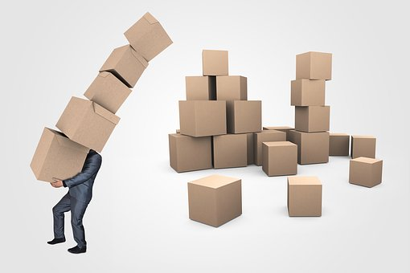
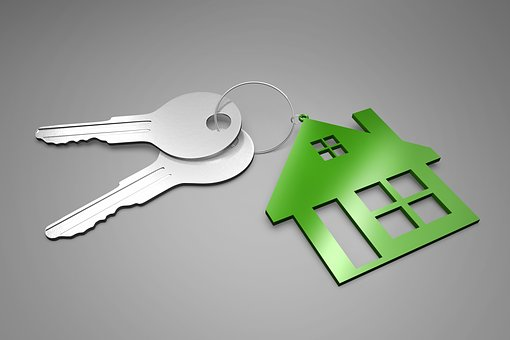

# Being happier developers

---

## Reset

Note: 
- last retro outcomes all symptoms of process
- reset, sane defaults and improve
- set a KPI

---

## Context/BG

Note: 
- A

---

## CD

Note: 
- A

---

## Failing at CD

Note: 
- A

---

## The Ask of Our Team

Note: 
- A

---

## Process

Note: 
- A

---

## Why

Note: 
- A

---

## Measuring

Note: 
- A

---

## Ownership

Note: 
- A

---

## My Asks of you as a team

Note: 
- A

